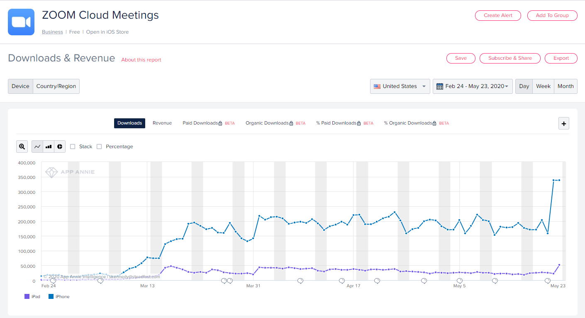
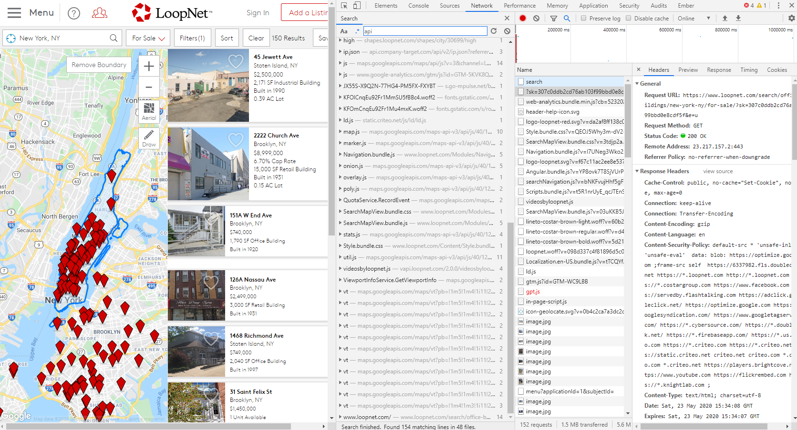

## Objective

Given the current uncertaintity surrounding the real estate market in the United States and in the world as a whole, we will aim to model what the new ***normal*** may look like for commercial and residential real estate in a post-COVID19 landscape. 

### Commercial Real Estate QOIs:

***Does use of zoom and other virtual meeting technologies make most office space worthless?***

- Impact of office closures on REITs
    - Revenue
    - Stock Prices

- Impact of office closures on real estate value in densly populated areas
    - General trends in value/sqft

### Residential Real Estate QOIs

***Will there be a meaningful shift away from living in densly populated areas such as NYC, Los Angeles, Chicago and other metro areas affected by COVID-19***

- Real estate prices and listings
- Census data

## Data Sets

#### Mobile App Downloads:

We have access to a database with download statistics for 1,000s of apps across a variety of platforms (iOs, android etc)



#### Financial Data (Bloomberg)

We have access to KPIs, stock prices, sentiment scores, machine readable news on every publicly traded company in the US. 

#### Credit Card Data

Access to credit card spend for a variety of consumer retail companies including breakdowns of online vs. in-store transactions.

#### Foot Traffic Data

SK to find a free option this week

#### COVID Data

All over the place but SK has code to pull/store data from [here](
https://services1.arcgis.com/0MSEUqKaxRlEPj5g/arcgis/rest/services/cases_time_v3/FeatureServer/0?f=json)

Not sure if this returns at the zip level, but we can pull from elsewhere if necessary.

#### Census Data


${L}_{ove-me-some-latex}$

#### Webscraped Data

- Zillow
- Apartments.com
- loopnet.com (commercial)



***cURL to python example for loopnet***

```{python}
    import requests
    cookies = {
        'SessionFarm_GUID': '98455935-19d4-4762-ac41-ea491adb1b8a',
        'gip': '^%^7b^%^22Display^%^22^%^3a^%^22New+York^%^2c+NY^%^22^%^2c^%^22GeographyType^%^22^%^3a2^%^2c^%^22Address^%^22^%^3a^%^7b^%^22City^%^22^%^3a^%^22New+York^%^22^%^2c^%^22PostalCode^%^22^%^3a^%^2210011^%^22^%^2c^%^22State^%^22^%^3a^%^22NY^%^22^%^2c^%^22ListingGeoCoded^%^22^%^3afalse^%^2c^%^22Country^%^22^%^3a^%^22US^%^22^%^7d^%^2c^%^22Location^%^22^%^3a^%^7b^%^22y^%^22^%^3a40.74^%^2c^%^22x^%^22^%^3a-74.0^%^7d^%^2c^%^22MatchType^%^22^%^3a0^%^7d',
        'LNUniqueVisitor': '3a566d75-2ad7-449a-956a-7bfc0a89204b',
        '_gcl_au': '1.1.1969188328.1590248001',
        '_ga': 'GA1.2.689426435.1590248001',
        '_gid': 'GA1.2.2095331028.1590248001',
        '_dc_gtm_UA-31346-1': '1',
        '_gaexp': 'GAX1.2.lNqP22NKT3OCe_d7T7wigQ.18472.1',
        'ak_bmsc': '9E5DBD6BAF39FFA3C3D5D55EA69DD6EA17DB5D67441E00004042C95E89D1513F~plFMbZLy9y1xB/myxTHReCf9G/0WXAXFEVoYcihnUTC3EUcT4CztbmY+Pmrv0UZFj59Etge3CdP8Cm1U8q7IdnfLLEOnu+cnOQDyEpdxCyyh05QBkPDiGbYVIaJxXupQx2P/ZXSZVmHKP7X+wYCD0uzAZYBSwQ92gAb/++y0Kx9LlaUWCv29/8kmxha90qpJssXucDOa50SHmOk//WnEjABRuyP9P+F9Oi/LVx8hiOPGua+bBwQAMGd3YQxomnkrX/',
        '_fbp': 'fb.1.1590248001389.1993513434',
        '_gat_UA-31346-1': '1',
        'lnwbprddc': '01',
        '.AspNet.PendingCookies': 'BMF1CDitfXPY8eRzuJJ1szkjeNeTznPaafNdI6iHdV3oexbN-e6NL-lB8gY5lV3jGKxohrZKlvuRR2t1RcSo4PePm0xj4AssXJEqv_eVSSdh56lI8bullMaAppPsz1gbG7JTrMpXNq1NLpREx5otEPBxXiueEjZ5NBxTljC3SOj6ChGr8g-NIXPPuGbl2Agg4jYwh6jMAaCnnoV15htd1nV_cnUjeiXnAp4aTdrjCvTjyE2PHdY0BmG1UeTkLh-qIyXne4JSNV0PABP3rzEnk2t3oRXI_SpJ188jEE-9L4iYitRp9Ci07coedZqZ6ICp62-ZRlNwMC5WEq0Y897FOE9CNtijWo8Oa7HiLxELIfguIunC',
        'LastSearchPropertyType': '^%^7B^%^22id^%^22^%^3A9001^%^2C^%^22pname^%^22^%^3A^%^22office^%^22^%^2C^%^22lid^%^22^%^3Anull^%^2C^%^22pid^%^22^%^3A32^%^2C^%^22sid^%^22^%^3A0^%^2C^%^22scid^%^22^%^3A0^%^2C^%^22name^%^22^%^3A^%^22Office^%^22^%^2C^%^22namel^%^22^%^3A^%^22office^%^22^%^2C^%^22isforsale^%^22^%^3Atrue^%^2C^%^22isbbs^%^22^%^3Afalse^%^2C^%^22notfound^%^22^%^3Atrue^%^2C^%^22url^%^22^%^3Anull^%^7D',
        'RT': '^\\^z=1^&dm=www.loopnet.com^&si=4d083796-f5d1-4763-88b8-17eeda0038c4^&ss=kajsll7v^&sl=2^&tt=31n^&bcn=^%^2F^%^2F173c5b09.akstat.io^%^2F^&ld=rw3^&nu=2qqicg3x^&cl=1096^&ul=1097^\\^',
        'LastSearchLocation': '^%^7b^%^22Typeahead^%^22^%^3a^%^22New+York^%^2c+NY^%^22^%^2c^%^22Geography^%^22^%^3a^%^7b^%^22ID^%^22^%^3a^%^2230699^%^22^%^2c^%^22Code^%^22^%^3a^%^22NY^%^22^%^2c^%^22Display^%^22^%^3a^%^22New+York^%^2c+NY^%^22^%^2c^%^22GeographyType^%^22^%^3a2^%^2c^%^22Address^%^22^%^3a^%^7b^%^22City^%^22^%^3a^%^22New+York^%^22^%^2c^%^22State^%^22^%^3a^%^22NY^%^22^%^2c^%^22ListingGeoCoded^%^22^%^3afalse^%^2c^%^22Country^%^22^%^3a^%^22US^%^22^%^7d^%^2c^%^22Location^%^22^%^3a^%^7b^%^22y^%^22^%^3a40.7829675^%^2c^%^22x^%^22^%^3a-73.9788291^%^7d^%^2c^%^22BoundingBox^%^22^%^3a^%^7b^%^22LowerRight^%^22^%^3a^%^7b^%^22y^%^22^%^3a40.683935^%^2c^%^22x^%^22^%^3a-73.910408^%^7d^%^2c^%^22UpperLeft^%^22^%^3a^%^7b^%^22y^%^22^%^3a40.882^%^2c^%^22x^%^22^%^3a-74.0472502^%^7d^%^7d^%^2c^%^22MatchType^%^22^%^3a3^%^7d^%^7d',
        'bm_sv': '4A407B5E79E6F236FA7FD3C31E3675D8~rQt3+QMjUr9O6GqPcVrSlCQES31g+BBICZi4+cygjcHu4s7yqamwcqVRaklHPy4Fc9u1YFDzeG2DMKBBpzB255dZdFydLboY/PKAuSicT9CH2QCuXYXzeGvGJN3DLSR3L6pzGM04/IL/YCTiZ22L9/3tmw97nSlykyPoUG86cRo=',
    }

    headers = {
        'Connection': 'keep-alive',
        'Cache-Control': 'max-age=0',
        'Upgrade-Insecure-Requests': '1',
        'User-Agent': 'Mozilla/5.0 (Windows NT 10.0; Win64; x64) AppleWebKit/537.36 (KHTML, like Gecko) Chrome/79.0.3945.88 Safari/537.36',
        'Sec-Fetch-User': '?1',
        'Accept': 'text/html,application/xhtml+xml,application/xml;q=0.9,image/webp,image/apng,*/*;q=0.8,application/signed-exchange;v=b3;q=0.9',
        'Sec-Fetch-Site': 'same-origin',
        'Sec-Fetch-Mode': 'navigate',
        'Referer': 'https://www.loopnet.com/',
        'Accept-Encoding': 'gzip, deflate, br',
        'Accept-Language': 'en-US,en;q=0.9',
    }

    params = (
        ('sk', '307c0ddb2cd76ab103f99bbd0e8cdf5f^'),
        ('e', 'u'),
    )

    response = requests.get('https://www.loopnet.com/search/office-buildings/new-york-ny/for-sale/', headers=headers, params=params, cookies=cookies)

    #NB. Original query string below. It seems impossible to parse and
    #reproduce query strings 100% accurately so the one below is given
    #in case the reproduced version is not "correct".
    # response = requests.get('https://www.loopnet.com/search/office-buildings/new-york-ny/for-sale/?sk=307c0ddb2cd76ab103f99bbd0e8cdf5f^&e=u', headers=headers, cookies=cookies)
```

### Models

#### Time Series Modeling

- Forecasted prices for residential and commercial real estate
- Forecasted occupance for residential and commercial real estate
- Forecasted KPIs for REITS
- Forecasted stock prices for REITS


#### ANOVA/Observational Studies

- Are there significant changes in consumer behaviour pre/post COVID
    - Slicing CC data into pre/post buckets and running various ANOVA analyses


